<div align="center">

# OnsetLab

### Tool-calling AI agents that run locally.

[](https://opensource.org/licenses/Apache-2.0)
[](https://python.org)
[](https://pypi.org/project/onsetlab/)
[](https://ollama.com)

[Install](#install) · [Quick Start](#quick-start) · [Architecture](#architecture) · [MCP Servers](#mcp-servers)

</div>

---

## The Problem

Building AI agents today means paying per API call, sending every request to someone else's server, and hoping the network stays up.

Local models are fast, free, and private. But ask one to call a tool and it falls apart. Wrong function names, broken parameters, infinite loops.

**The models are capable. The framework wasn't.**

## The Solution

OnsetLab makes 3B-7B models do reliable tool calling through a hybrid REWOO/ReAct architecture. The framework handles planning, execution, and error recovery. The model only does what it's good at: one step at a time.

```
pip install onsetlab  →  connect Ollama  →  add tools  →  run
```

No API keys. No fine-tuning. No cloud.

---

## Install

```bash
pip install onsetlab
```

Requires [Ollama](https://ollama.com) running locally:

```bash
ollama pull qwen2.5:7b
```

## Quick Start

```python
from onsetlab import Agent
from onsetlab.tools import Calculator, DateTime

agent = Agent("qwen2.5:7b", tools=[Calculator(), DateTime()])

result = agent.run("What's 15% tip on $84.50?")
print(result.answer)
```

The agent routes the query, builds an execution plan, calls the calculator, and returns the answer. No prompt engineering required.

---

## Architecture

```mermaid
flowchart TD
    Q["🔍 Query"] --> R["Router (model-driven)"]

    R -->|"no tools needed"| D["DIRECT - answer from model knowledge"]
    R -->|"tools needed"| P["Planner - THINK → PLAN"]

    P --> E["Executor - run tools, resolve dependencies"]
    E --> S["Solver - synthesize final answer"]

    P -. "plan fails" .-> RE["ReAct Fallback - think → act → observe"]

    D --> A["✅ Answer"]
    S --> A
    RE --> A

    style Q fill:#1a1a2e,stroke:#e94560,color:#fff
    style R fill:#16213e,stroke:#0f3460,color:#fff
    style D fill:#0f3460,stroke:#533483,color:#fff
    style P fill:#0f3460,stroke:#533483,color:#fff
    style E fill:#0f3460,stroke:#533483,color:#fff
    style S fill:#0f3460,stroke:#533483,color:#fff
    style RE fill:#533483,stroke:#e94560,color:#fff
    style A fill:#1a1a2e,stroke:#e94560,color:#fff
```



### Router

The model itself decides the strategy. No regex, no keyword matching. The SLM reads the query and available tools, then classifies: `REWOO` (needs tools) or `DIRECT` (answer from knowledge). Trivial greetings are caught before the model is even called.

### Planner

Generates a structured `THINK → PLAN` output. Each plan step specifies a tool, parameters, and dependencies on previous steps. Tool rules are auto-generated from JSON schemas, so the model sees exactly what each tool can do.

### Executor

Resolves dependencies between steps and runs tool calls in order. If step 2 depends on step 1's output, the result is substituted automatically.

### ReAct Fallback

If REWOO planning fails (bad format, wrong tool, missing params), the agent switches to iterative `Thought → Action → Observation` loops. Catches edge cases that structured planning misses.

---

## MCP Servers

Connect any [MCP-compatible](https://modelcontextprotocol.io) server to give your agent access to external tools.

**From the built-in registry:**

```python
from onsetlab import Agent, MCPServer

server = MCPServer.from_registry("filesystem", extra_args=["/path/to/dir"])

agent = Agent("qwen2.5:7b")
agent.add_mcp_server(server)

result = agent.run("List all Python files in the directory")
print(result.answer)

agent.disconnect_mcp_servers()
```

**Any MCP server from npm:**

```python
# Web search (requires API key)
server = MCPServer(
    name="tavily",
    command="npx",
    args=["-y", "tavily-mcp@latest"],
    env={"TAVILY_API_KEY": "..."}
)

# Fetch web pages (no key needed)
server = MCPServer(
    name="fetch",
    command="npx",
    args=["-y", "@tokenizin/mcp-npx-fetch"],
)

agent.add_mcp_server(server)
```

**Built-in registry:** `filesystem` · `github` · `slack` · `notion` · `google_calendar` · `tavily`

---

## Built-in Tools

| Tool | Description |
|------|-------------|
| `Calculator` | Math expressions, percentages, sqrt/sin/log |
| `DateTime` | Current time, timezones, date math, day of week |
| `UnitConverter` | Length, weight, temperature, volume, speed, data |
| `TextProcessor` | Word count, find/replace, case transforms, pattern extraction |
| `RandomGenerator` | Random numbers, UUIDs, passwords, dice rolls, coin flips |

> More tools will be added over time.

## Tested Models

| Model | Size | Notes |
|-------|------|-------|
| `qwen2.5:7b` | 7B | Best results for tool calling |
| `qwen2.5:3b` | 3B | Fast, good for simple tasks |
| `phi3.5` | 3.8B | Solid balance of speed and quality |
| `llama3.2:3b` | 3B | General purpose |

Works with any model available through Ollama.

## Configuration

```python
agent = Agent(
    model="qwen2.5:7b",       # any Ollama model
    tools=[...],               # built-in tools
    memory=True,               # conversation memory
    verify=True,               # pre-execution plan verification
    routing=True,              # model-driven strategy selection
    react_fallback=True,       # automatic fallback on planning failure
    debug=False,               # verbose logging
)
```

---

## License

Apache 2.0
